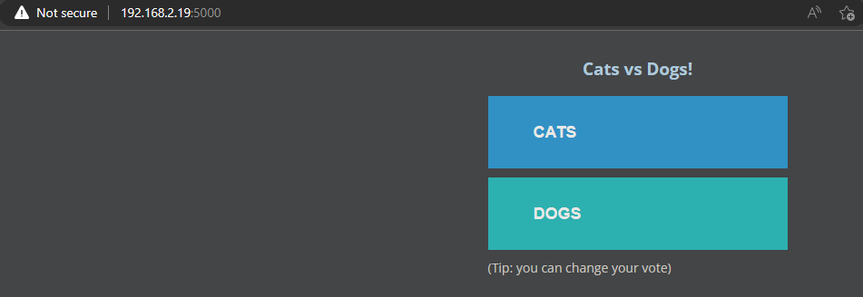
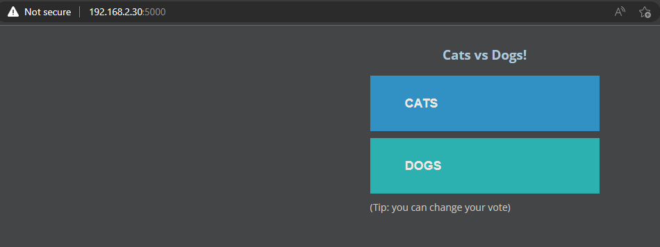
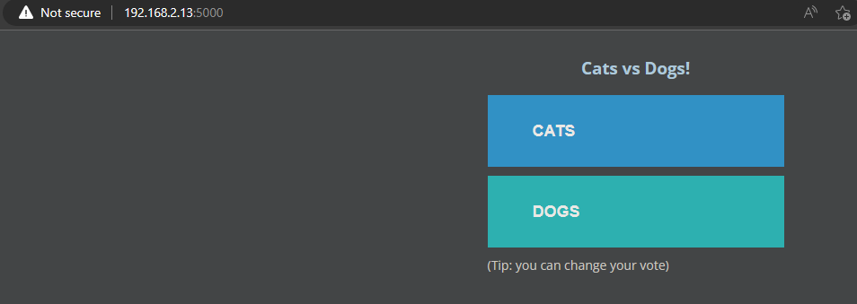
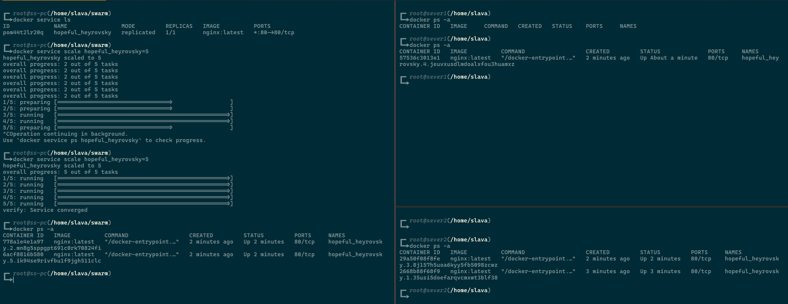
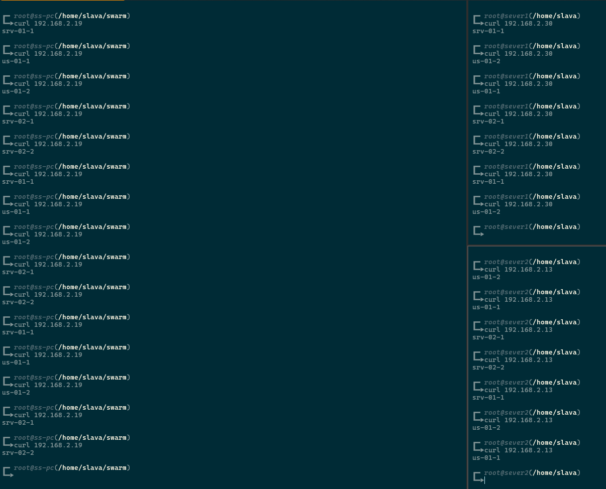
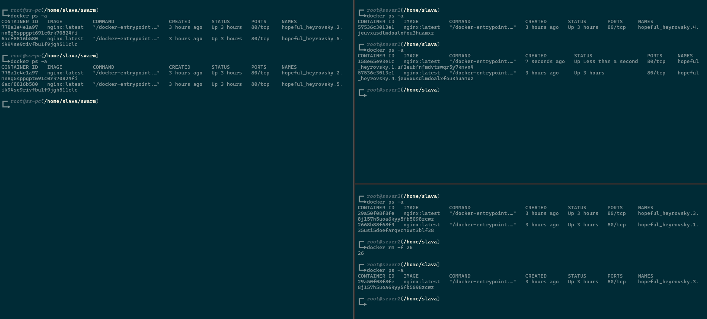
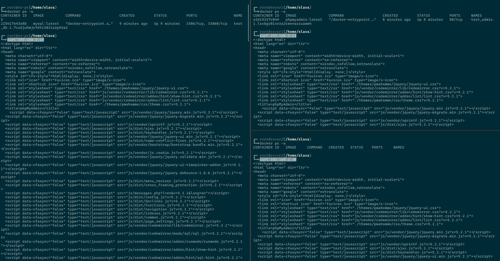

Чернышева Анна 
ЦП | Разработчик. Программист (Frontend) | 3416 | 2
# Контейнеризация (семинары)

## Урок 5. Docker Compose и Docker Swarm

Задание 1:

1. создать сервис, состоящий из 2 различных контейнеров: 1 - веб, 2 - БД
2. далее необходимо создать 3 сервиса в каждом окружении (dev, prod, lab)
3. по итогу на каждой ноде должно быть по 2 работающих контейнера
4. выводы зафиксировать

ИЛИ повторить развёртывание сервиса nginx с несколькими репликами на разных нодах.

Задание 2\*:

1. нужно создать 2 ДК-файла, в которых будут описываться сервисы
2. повторить задание 1 для двух окружений: lab, dev
3. обязательно проверить и зафиксировать результаты, чтобы можно было выслать преподавателю для проверки

Задание со звездочкой - повышенной сложности, это нужно учесть при выполнении (но сделать его необходимо).

Задание 1:

1. `docker swarm init` - инициализация кластера, присоединить две машины. 

   `docker node ls` - просмотр кластера 

   

   

2. Задание с сайта https://bday2021.play-with-docker.com/voting-app/

   `git clone https://github.com/dockersamples/example-voting-app && cd example-voting-app` <br>
   `docker stack deploy --compose-file docker-stack.yml vote` 
   

   ```yaml
   # version is now using "compose spec"
   # v2 and v3 are now combined!
   # docker-compose v1.27+ required

   services:
   vote:
      build: ./vote
      # use python rather than gunicorn for local dev
      command: python app.py
      depends_on:
         redis:
         condition: service_healthy
      healthcheck:
         test: ["CMD", "curl", "-f", "http://localhost"]
         interval: 15s
         timeout: 5s
         retries: 3
         start_period: 10s
      volumes:
      - ./vote:/app
      ports:
         - "5000:80"
      networks:
         - front-tier
         - back-tier

   result:
      build: ./result
      # use nodemon rather than node for local dev
      entrypoint: nodemon server.js
      depends_on:
         db:
         condition: service_healthy
      volumes:
         - ./result:/app
      ports:
         - "5001:80"
         - "5858:5858"
      networks:
         - front-tier
         - back-tier

   worker:
      build:
         context: ./worker
      depends_on:
         redis:
         condition: service_healthy
         db:
         condition: service_healthy
      networks:
         - back-tier

   redis:
      image: redis:alpine
      volumes:
         - "./healthchecks:/healthchecks"
      healthcheck:
         test: /healthchecks/redis.sh
         interval: "5s"
      networks:
         - back-tier

   db:
      image: postgres:15-alpine
      environment:
         POSTGRES_USER: "postgres"
         POSTGRES_PASSWORD: "postgres"
      volumes:
         - "db-data:/var/lib/postgresql/data"
         - "./healthchecks:/healthchecks"
      healthcheck:
         test: /healthchecks/postgres.sh
         interval: "5s"
      networks:
         - back-tier

   # this service runs once to seed the database with votes
   # it won't run unless you specify the "seed" profile
   # docker compose --profile seed up -d
   seed:
      build: ./seed-data
      profiles: ["seed"]
      depends_on:
         vote:
         condition: service_healthy
      networks:
         - front-tier
      restart: "no"

   volumes:
   db-data:

   networks:
   front-tier:
   back-tier:
   ```

   `docker service ls` 

   

   идём по адресу `IP:5000` - голосуем <br>
   проверяем результаты `IP:5001` <br>

    <br>

   По адресам любой из машин в кластере, сервис голосования доступен <br>

    <br>
    <br>
    <br>

   <br>

3. Повтор действий с семинара: <br>
   `docker swarm init` <br>

    <br>

   `docker swarm join --token SWMTKN-1-5hgc5oghjud2gxkirlnuz86lof637gh4ubbruhgi0huqbhkej2-9x0gni6x0ys3h1mdmrogfnflu 192.168.2.19:2377` <br>
   `docker node ls` <br>

    <br>

   `docker service create -d -p 80:80 nginx` <br>
   `docker service scale hopeful_heyrovsky=5` <br>
   `docker ps -a` <br>

    <br>

   `docker exec -it 7 bash` -> `echo us-01-1 > /usr/share/nginx/html/index.html` (и так на всех контейнерах) <br>

    <br>

   на server2 - `docker rm -f 26`, `docker ps -a` <br>

    <br>

   `docker service rm hopeful_heyrovsky` <br>
   `cd ../compse/`, `nano compose.yaml` <br>

   ```yaml
   version: "3"

   services:
     db:
       image: mysql
       environment:
         MYSQL_ROOT_PASSWORD: 123
       networks:
         - my_net

     admin:
       image: phpmyadmin
       networks:
         - my_net
       ports:
         - 80:80

   networks:
     my_net:
   ```

   `docker system prune -af` - удалить все образы на server1, server2 <br>
   `docker stack up -c compose.yaml test` <br>
   на любом IP кластера открываются страницы <br>

    <br>
